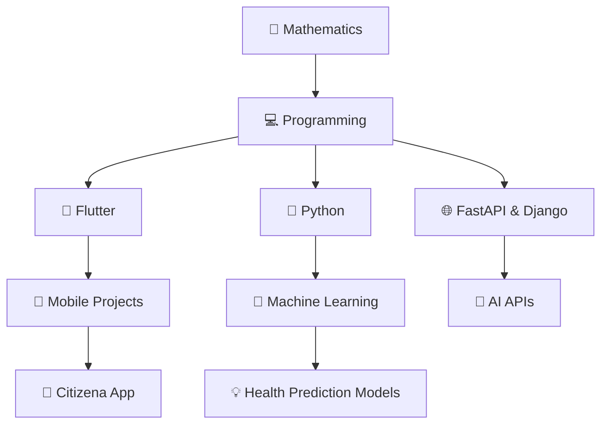

# 🌟 Welcome to My Digital Universe

```ascii
╔═══════════════════════════════════════════════════════════════╗
║  ███╗   ███╗ ██████╗ ███╗   ██╗██████╗  █████╗ ██╗   ██╗    ║
║  ████╗ ████║██╔═══██╗████╗  ██║██╔══██╗██╔══██╗╚██╗ ██╔╝    ║
║  ██╔████╔██║██║   ██║██╔██╗ ██║██║  ██║███████║ ╚████╔╝     ║
║  ██║╚██╔╝██║██║   ██║██║╚██╗██║██║  ██║██╔══██║  ╚██╔╝      ║
║  ██║ ╚═╝ ██║╚██████╔╝██║ ╚████║██████╔╝██║  ██║   ██║       ║
║  ╚═╝     ╚═╝ ╚═════╝ ╚═╝  ╚═══╝╚═════╝ ╚═╝  ╚═╝   ╚═╝       ║
║                                                               ║
║     🔮 Mathematician • Flutter Developer • ML Explorer 🔮     ║
╚═══════════════════════════════════════════════════════════════╝
```

<div align="center">

### 🎯 Currently in the Zone

```yaml
monday@universe:~$ whoami
```

**Name**: Okwharobo Solomon  
**Role**: Flutter Developer • Mathematician • ML Enthusiast  
**Status**: Building intelligent apps, one commit at a time  
**Location**: Nigeria 🇳🇬  

</div>

---

## 🧠 My Mental Stack

<div align="center">



</div>

---

## 🏗️ Current Quests

<table>
<tr>
<td width="50%">

### 🔧 Active Projects
- 📱 **Citizena** – AI civic education & accountability app  
- 📊 **Suchi-Teki** – Numerical methods toolkit (Flutter + FastAPI)  
- ❤️ **Health Prediction** – ML for heart & cholera detection  
- 🤖 **CycleAI** – Menstrual tracking + AI chatbot  

### 🌱 Learning Tree
- Deep learning: CNNs, LSTMs, Transformers  
- Advanced Flutter animations  
- Serverpod & Supabase integration  
- Mathematical optimization

</td>
<td width="50%">

### 🎪 Fun Zone

```python
class Solomon:
    def __init__(self):
        self.pronouns = "He/Him"
        self.loves = ["🎵 Music", "📚 Learning", "🚀 Innovation"]
        self.debugging_style = "Rubber Duck Driven 🦆"
        self.coffee_level = "Always Full ☕"
    
    def get_motto(self):
        return "Code with purpose, dream with math! 🌟"
```

</td>
</tr>
</table>

---

## 🛠️ Toolkit Arsenal

<div align="center">

### **Primary Weapons**


### **Support Spells**


</div>

---

## 📊 Battle Statistics

<div align="center">


</div>

---

## 🎵 Vibe Check

<div align="center">

```
🎧 Currently Playing: Lo-fi beats while coding  
🎯 Focus Mode: ACTIVATED  
☕ Coffee Status: Brewing...  
🦆 Rubber Duck: Ready for debugging session  
```

**Life Philosophy**: *"In mathematics we find truth, in code we build dreams!"*

</div>

---

## 🌐 Connect & Collaborate

<div align="center">

[](mailto:mondaysolomon01@gmail.com)  
[](https://x.com/SOkwharobo)  
[](https://linkedin.com/in/your-profile)

</div>

---

<div align="center">

### 🎲 Random Developer Wisdom


</div>

---

<div align="center">

```
⭐ Star repos you find interesting • 🍴 Fork and contribute • 💬 Let's build something amazing together!
```

**Last Updated**: With love and caffeine ☕ | **Visitors**: 

</div>

---

<div align="center">
  
</div>
